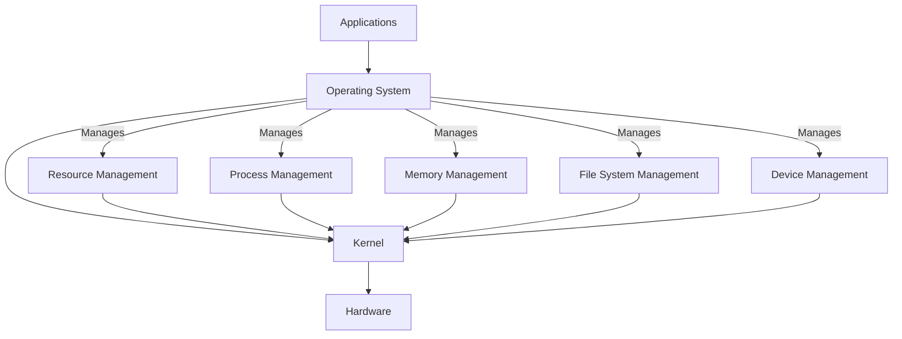

# Linux notes
------------------------
* [Operating Systems](#operating-systems)
* [Virtualization](#virtualization)
* [Linux File System](#linux-file-system)
* [Command Line Basics](#command-line-basics)
* [Package Manager](#package-manager)
------------------------
<h2 id="operating-systems">Operating systems</h2>

Operating system is the layer between the hardware and the applications; if there wasn't that layer, all of the user apps would have to handle hardware resources themselves



- **Main Responsibilities**:
  - **Resource Management**:
    - Manages CPU, memory, storage, and I/O devices
    - Allocates resources to various applications and users, balancing performance
  - **Process Management**:
    - Handles the creation, scheduling, and termination of processes
    - Manages process states: running, waiting, and ready
  
  ```mermaid
  graph TD
    A[New] -->|Process Created| B[Ready]
    B -->|Scheduler Picks| C[Running]
    C -->|I/O Request| D[Waiting]
    D -->|I/O Completed| B
    C -->|Time Slice Expired| B
    C -->|Process Completed| E[Terminated]
  ```

  - **Memory Management**:
    - Controls memory allocation to processes
    - Uses concepts like **virtual memory** to extend physical memory

  ```mermaid
  graph TD
    A[Virtual Memory] --> B[Page Table]
    A2[Process 1] -->|Uses| A
    A3[Process 2] -->|Uses| A
    A4[Process 3] -->|Uses| A
    B --> C[Physical Memory]
    C --> D[Paging System]
    D -->|Maps Virtual to Physical| A
  ```

  - **File System Management**:
    - Manages file storage, organization, and access
    - Uses directories, permissions, and file types to maintain structure
  
  ```mermaid
  graph TD
    A[Root Directory]
    A --> B[Home]
    A --> C[Etc]
    A --> D[Var]
    A --> E[Usr]

    B --> F[User1]
    B --> G[User2]

    F --> H[Documents]
    F --> I[Downloads]
    F --> J[Pictures]

    C --> K[Config1.conf]
    C --> L[Config2.conf]

    D --> M[Log]
    D --> N[Cache]

    E --> O[Bin]
    E --> P[Lib]
    E --> Q[Share]
  ```

  - **Device Management**:
    - Manages input/output devices (e.g., keyboards, monitors)
    - Uses device drivers to communicate with hardware

- **Types of Operating Systems**:
  - **Single-User vs. Multi-User**:
    - Single-user OS: One user at a time (e.g., Windows Home)
    - Multi-user OS: Supports multiple users simultaneously (e.g., Unix)
  - **Batch OS**:
    - Executes a series of jobs without manual intervention
    - Common in early mainframe computers
  - **Real-Time OS (RTOS)**:
    - Designed for applications that need immediate processing (e.g., medical systems)
  - **Distributed OS**:
    - Manages a group of distinct computers, making them appear as a single system
  - **Embedded OS**:
    - Optimized for embedded devices like smart appliances, with minimal resources

- **Kernel**:
  - Core component of an OS that manages system resources
  - Handles communication between hardware and software
  - **Types of Kernels**:
    - **Monolithic Kernel**: All OS services run in a single space (e.g., Linux)
    - **Microkernel**: Minimal core services, with additional services running separately (e.g., Minix)

<p align="center">
  <a href="https://github.com/isabellabreder/sre-studies/blob/linux/00-linux/attachments/os-structure.png">
    
  </a>
</p>


------------------------
<h2 id="virtualization">Virtualization</h2>

- **Virtual Machines (VMs)**
  - A VM is an instance of an operating system running in isolation within another operating system
  - It allows different operating systems to run on the same physical hardware
  - Each VM has its own OS and shares the physical resources (CPU, memory, storage) of the host
  - Provides full isolation, where each VM operates like a separate physical computer (the computer doesn't know that it's placed on top of another one)
  - If something breaks inside the VM, it doesn't affects the actual computer

<p align="center">
  <a href="https://github.com/isabellabreder/sre-studies/blob/linux/00-linux/attachments/vms.png">
    
  </a>
</p>

- **Hypervisor**
  - The hypervisor (or virtual machine monitor) is the software layer that enables multiple virtual machines to run on a single physical machine
  - It manages the distribution of hardware resources among VMs
  - It creates a virtual environment that acts like hardware for each VM
  - They are essential for creating and managing VMs

- **Types of Hypervisors**
  - Type 1 (Bare-metal Hypervisor):
    - Runs directly on the host's hardware, with no underlying operating system
    - Examples: VMware ESXi, Microsoft Hyper-V, and Xen
    - Generally more efficient because it doesn't require a host OS
    - Suitable for enterprise environments
  - Type 2 (Hosted Hypervisor):
    - Runs on top of a host operating system.
    - Examples: VMware Workstation, Oracle VirtualBox, and Parallels Desktop
    - Easier to set up and use, making it ideal for development and testing environments

<p align="center">
  <a href="https://github.com/isabellabreder/sre-studies/blob/linux/00-linux/attachments/hypervisor.png">
    
  </a>
</p>

- **Benefits and usage**
  - **Type 1**:
    - Efficient usage of hardware resources
    - Use all the resources of a performant big server
    - Users can choose any resource combination
    - Abstraction of the OS from the hardware
    - Virtual machine image (VMI): the OS as a portable file
  - **Type 2**:
    - You don't have to buy a new computer for learn and experiment
    - Don't endanger you main OS
    - Testing some app on different OS

- **Key concepts**
  - **Virtualization host**: the physical machine that hosts the VMs 
  - **Guest OS**: the OS running inside a VM
  - **Virtual network**: hypervisors can create virtual networks that allow VMs to communicate with each other or with external networks
  - **Snapshots**: saved state of a VM at a specifc point in time, allowing rollback 
  - **VM migration**: process of moving a VM from one host to another with minimal downtime, useful for load balancing and maintenance


------------------------
<h2 id="linux-file-system">Linux File System</h2>


- **Hierarchical Tree Structure**: 
  - The file system is organized in a hierarchical tree with directories and subdirectories, starting from a single root directory (`/`).

- **1 Root Directory (`/`)**:
  - The top-most directory in the Linux file system.

<p align="center">
  <a href="https://github.com/isabellabreder/sre-studies/blob/linux/00-linux/attachments/filesys.png">
    
  </a>
</p>

- **`/home`**:
  - Home space for all non-root users.
  - Allows multiple users on the same computer, with each having their own space and configurations.
  - Contains hidden files (dotfiles), usually starting with a dot (`.`), which are often configuration files automatically generated by programs or the OS.

- **`/root`**:
  - Home directory for the root (superuser).
  - Separate from `/home` to provide isolation between regular users and the root user.

- **`/bin`**:
  - Contains essential user command binaries (executables), like `ls`, `cp`, `mv`, etc.
  - Available to all users and required for basic system operations.

- **`/sbin`**:
  - Contains system binaries that require superuser privileges to run.
  - Includes commands for system administration, like `fdisk`, `reboot`, etc.

- **`/lib`**:
  - Holds shared libraries required by the binaries in `/bin` and `/sbin`.
  - Libraries are similar to DLL files in Windows.

- **`/usr`**:
  - Originally intended for user binaries; now contains secondary, non-essential applications and libraries.
  - Mirrors the structure of the root directory for historical reasons.
  - **`/usr/local`**: 
    - Contains software installed manually by the user.
    - Programs here are available to all users. To make software available only to a specific user, install it in `/home`.

- **`/opt`**:
  - Directory for optional, third-party software.
  - Used for applications that don’t follow the usual Linux directory structure.
  - Unlike `/usr/local`, software installed here often keeps all its files in a single subdirectory.

- **`/boot`**:
  - Contains files needed for booting the system, including the Linux kernel, boot loader configuration, and initial RAM disk.

- **`/etc`**:
  - Contains configuration files for system-wide applications.
  - Writable and used for storing configuration settings.

- **`/dev`**:
  - Holds device files that represent hardware devices (e.g., webcam, mouse, disk drives).
  - Allows applications and drivers to interact with the hardware.

- **`/var`**:
  - Stands for "variable."
  - Contains files that change frequently, like logs, spool files, and caches.
  - Examples include `/var/log` for log files and `/var/cache` for cached data.

- **`/tmp`**:
  - Temporary directory for files required by the system or applications for short-term use.
  - Files in `/tmp` are typically deleted on system reboot.

- **`/media`**:
  - Contains mount points for removable media like USB drives, CDs, and DVDs.
  - When a device is inserted, it is automatically mounted here.

- **`/mnt`**:
  - Historically used for manually mounting file systems or external drives.
  - Often used by system administrators for temporary file systems.

------------------------
<h2 id="command-line-basics">Command Line Basics</h2>

### Uses
- **File System Operations**:
  - Create folders
  - List files in a directory
  - Rename and remove files
- **Display OS Information**

### GUI vs CLI
- **GUI**: Graphical User Interface
- **CLI**: Command Line Interface
  - On servers, only the CLI is typically available.
  - A terminal prompt displays:
    - The Linux user you’re logged in as
    - The computer name
    - The current directory
    - An indicator of whether you’re a regular user (`$`) or a root user (`#`)
    - Example: `username@computer-name: [directory]$`

### Basic Commands

#### Directory Operations
- `pwd`: Print Working Directory; shows the current directory path.
- `ls`: List directories and files in the current directory.
  - `ls -R`: Recursively lists all files and directories within subdirectories.
  - `ls -a`: Lists all files, including hidden files (dotfiles).
  - `ls -l`: Lists files with detailed information (permissions, owner, etc.).
  - **Note**: Flags can be combined, e.g., `ls -la`.
- `cd [dirname]`: Change Directory; navigates to `[dirname]`.
  - `cd ..`: Moves up one directory.
  - `cd /`: Moves to the root directory.
- `mkdir [dirname]`: Make Directory; creates a new directory named `[dirname]`.
- `clear`: Clears the terminal screen.

#### File Operations
- `touch [filename]`: Creates a new file named `[filename]` (include file extension).
- `rm [filename]`: Removes `[filename]`.
  - `rm -r [dirname]`: Recursively deletes `[dirname]` and its contents.
  - `rm -d [dirname]` *or* `rmdir [dirname]`: Deletes an empty directory.
- `cat [filename]`: Concatenate; displays the contents of `[filename]`.

<div style="border-left: 4px solid #007bff; padding: 8px; background-color: #f1f8ff;">
    📌 <strong>Note:</strong> In Linux, everything is considered a "file" — from documents and images to directories, commands, and devices.
</div>

#### Navigating the File System
- `cd [absolute path]`: Navigates to the specified absolute path, regardless of the current directory.  
  - Note: An absolute path starts from the root directory `/`. You can also abbreviate your home directory as `~`.
- `ls [absolute path]`: Lists contents of the specified path without changing the current directory.

#### Other Useful Commands
- `mv [filename] [new_filename]`: Renames `[filename]` to `[new_filename]`.
- `cp -r [dirname] [new_dirname]`: Copies `[dirname]` to `[new_dirname]`, including all contents.
- `history`: Lists all past commands in the current session.
  - Use arrow keys to navigate through command history.
  - `ctrl+r`: Searches for commands in history.
  - `history [n]`: Lists the last `[n]` commands.
- `clear`: Clears the terminal window (can also be done with `ctrl+l`).
- `ctrl+c`: Stops the execution of the current command.
- `uname -a`: Displays system and kernel information.
- `cat /etc/os-release`: Shows the OS version.
- `lscpu`: Displays CPU architecture information.
- `lsmem`: Displays memory information.
- `su - [username]`: Switches to `[username]`.

> There are numerous other useful commands. A cheat sheet or web search can be handy for finding commands when needed.

<p align="center">
  <a href="https://github.com/isabellabreder/sre-studies/blob/linux/00-linux/attachments/commands.jpg">
    
  </a>
</p>

### Why Use the CLI?
- The CLI is:
  - Efficient and quick once you’re familiar with it.
  - Ideal for bulk operations.
  - Often more powerful than a GUI.

### Executing Commands as a Superuser
- Certain commands require root privileges, such as `adduser`.
- `sudo [command]`: Runs `[command]` with superuser privileges, allowing regular users to execute commands that would otherwise require root access.


------------------------
<h2 id="package-manager">Package Manager</h2>

- You will typically install apps using a **package manager** tool.

### Software package
- A software package is a compressed archive containing all the required files for an application.
- Applications often have **dependencies**—other software libraries or tools needed for them to run.
  - Dependencies are usually not bundled with the main package and need to be installed separately.
- In Linux, software files are distributed across various directories, making it challenging to manage everything manually.
  
### Package manager
- A package manager:
  - Downloads, installs, or updates software from a repository.
  - Ensures the integrity and authenticity of packages.
  - Manages and resolves dependencies for you.
  - Knows where to place all files within the Linux file system.
  - Makes software upgrades easy.
- Every Linux distribution includes a package manager.
  - **Ubuntu**: `apt` (Advanced Package Tool).

<p align="center">
  <a href="https://github.com/isabellabreder/sre-studies/blob/linux/00-linux/attachments/package-manager.png">
    
  </a>
</p>

### Using `apt` to manage software
- `apt` commands:
  - `apt search <package_name>`: Searches for available versions of the specified package.
  - `apt install <package_name>`: Installs the specified package.
    - You can install multiple packages simultaneously: `apt install <package_name1> <package_name2>`.
  - `apt remove <package_name>`: Removes the installed package.

### Difference between `apt` and `apt-get`
- `apt-get` is an older command-line tool also available on Ubuntu.
  - **Limitations**: Lacks some usability features, such as a `search` command.
- `apt`:
  - A newer, more user-friendly tool.
  - Has fewer, more organized commands.
  - Recommended for most users.

### Repositories
- Repositories are storage locations containing thousands of software packages.
- The package manager fetches packages from these repositories.
- **Updating the Package Index**:
  - Always update the package index before installing or upgrading software.
  - `apt update`: Refreshes the package index with the latest records from repositories.
  - The APT package index is a database containing information on available packages.

### Alternative ways to install software

#### Why use alternatives?
- Some software packages may not be available in official repositories, or the repository may not contain the latest version.
- Packages undergo verification before being added to repositories, which can delay availability.

#### Alternatives
1. **Ubuntu Software Center**: A graphical interface for managing software.
2. **Snap Package Manager**:
   - A **snap** is a bundle of an app and its dependencies, making it self-contained.
   - **Snap Store**: A platform to upload snaps, as well as browse and install software.
3. **Add a repository**:
   - You can add new repositories to the list and fetch packages directly.
   - **PPA (Personal Package Archive)**:
     - Community-provided repositories often used by developers to release updates faster than in the official repositories.

