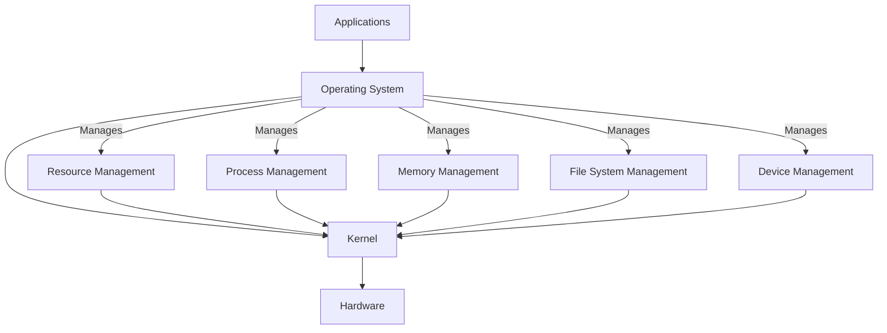

# Linux notes
------------------------
* [Operating Systems](#operating-systems)
* [Virtualization](#virtualization)
------------------------
<h2 id="operating-systems">Operating systems</h2>

Operating system is the layer between the hardware and the applications; if there wasn't that layer, all of the user apps would have to handle hardware resources themselves



- **Main Responsibilities**:
  - **Resource Management**:
    - Manages CPU, memory, storage, and I/O devices
    - Allocates resources to various applications and users, balancing performance
  - **Process Management**:
    - Handles the creation, scheduling, and termination of processes
    - Manages process states: running, waiting, and ready
  
  ```mermaid
  graph TD
    A[New] -->|Process Created| B[Ready]
    B -->|Scheduler Picks| C[Running]
    C -->|I/O Request| D[Waiting]
    D -->|I/O Completed| B
    C -->|Time Slice Expired| B
    C -->|Process Completed| E[Terminated]
  ```

  - **Memory Management**:
    - Controls memory allocation to processes
    - Uses concepts like **virtual memory** to extend physical memory

  ```mermaid
  graph TD
    A[Virtual Memory] --> B[Page Table]
    A2[Process 1] -->|Uses| A
    A3[Process 2] -->|Uses| A
    A4[Process 3] -->|Uses| A
    B --> C[Physical Memory]
    C --> D[Paging System]
    D -->|Maps Virtual to Physical| A
  ```

  - **File System Management**:
    - Manages file storage, organization, and access
    - Uses directories, permissions, and file types to maintain structure
  
  ```mermaid
  graph TD
    A[Root Directory]
    A --> B[Home]
    A --> C[Etc]
    A --> D[Var]
    A --> E[Usr]

    B --> F[User1]
    B --> G[User2]

    F --> H[Documents]
    F --> I[Downloads]
    F --> J[Pictures]

    C --> K[Config1.conf]
    C --> L[Config2.conf]

    D --> M[Log]
    D --> N[Cache]

    E --> O[Bin]
    E --> P[Lib]
    E --> Q[Share]
  ```

  - **Device Management**:
    - Manages input/output devices (e.g., keyboards, monitors)
    - Uses device drivers to communicate with hardware

- **Types of Operating Systems**:
  - **Single-User vs. Multi-User**:
    - Single-user OS: One user at a time (e.g., Windows Home)
    - Multi-user OS: Supports multiple users simultaneously (e.g., Unix)
  - **Batch OS**:
    - Executes a series of jobs without manual intervention
    - Common in early mainframe computers
  - **Real-Time OS (RTOS)**:
    - Designed for applications that need immediate processing (e.g., medical systems)
  - **Distributed OS**:
    - Manages a group of distinct computers, making them appear as a single system
  - **Embedded OS**:
    - Optimized for embedded devices like smart appliances, with minimal resources

- **Kernel**:
  - Core component of an OS that manages system resources
  - Handles communication between hardware and software
  - **Types of Kernels**:
    - **Monolithic Kernel**: All OS services run in a single space (e.g., Linux)
    - **Microkernel**: Minimal core services, with additional services running separately (e.g., Minix)

  


------------------------
<h2 id="virtualization">Virtualization</h2>

- **Virtual Machines (VMs)**
  - A VM is an instance of an operating system running in isolation within another operating system
  - It allows different operating systems to run on the same physical hardware
  - Each VM has its own OS and shares the physical resources (CPU, memory, storage) of the host
  - Provides full isolation, where each VM operates like a separate physical computer (the computer doesn't know that it's placed on top of another one)
  - If something breaks inside the VM, it doesn't affects the actual computer

  

- **Hypervisor**
  - The hypervisor (or virtual machine monitor) is the software layer that enables multiple virtual machines to run on a single physical machine
  - It manages the distribution of hardware resources among VMs
  - It creates a virtual environment that acts like hardware for each VM
  - They are essential for creating and managing VMs

- **Types of Hypervisors**
  - Type 1 (Bare-metal Hypervisor):
    - Runs directly on the host's hardware, with no underlying operating system
    - Examples: VMware ESXi, Microsoft Hyper-V, and Xen
    - Generally more efficient because it doesn't require a host OS
    - Suitable for enterprise environments
  - Type 2 (Hosted Hypervisor):
    - Runs on top of a host operating system.
    - Examples: VMware Workstation, Oracle VirtualBox, and Parallels Desktop
    - Easier to set up and use, making it ideal for development and testing environments

  

- **Benefits and usage**
  - **Type 1**:
    - Efficient usage of hardware resources
    - Use all the resources of a performant big server
    - Users can choose any resource combination
    - Abstraction of the OS from the hardware
    - Virtual machine image (VMI): the OS as a portable file
  - **Type 2**:
    - You don't have to buy a new computer for learn and experiment
    - Don't endanger you main OS
    - Testing some app on different OS

- **Key concepts**
  - **Virtualization host**: the physical machine that hosts the VMs 
  - **Guest OS**: the OS running inside a VM
  - **Virtual network**: hypervisors can create virtual networks that allow VMs to communicate with each other or with external networks
  - **Snapshots**: saved state of a VM at a specifc point in time, allowing rollback 
  - **VM migration**: process of moving a VM from one host to another with minimal downtime, useful for load balancing and maintenance


